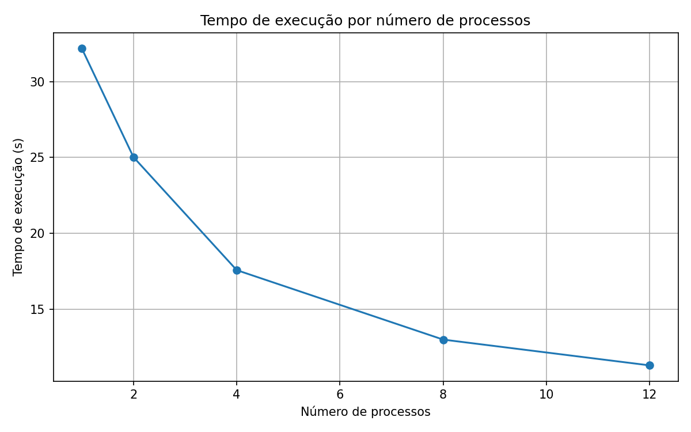
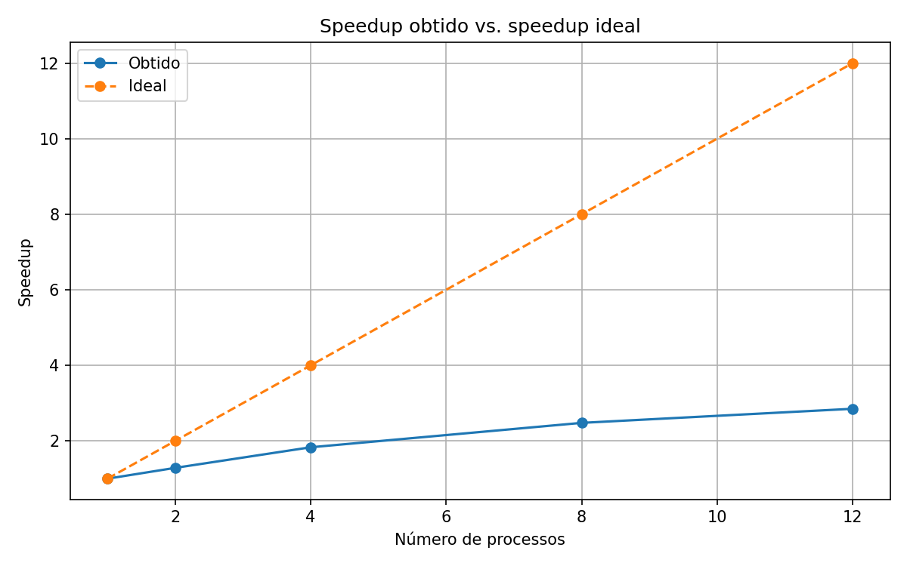
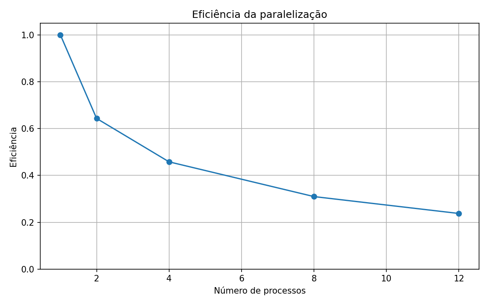

# Relatório da Atividade 5 – MPI

**Disciplina:** Programação Concorrente  
**Aluno(s):** Arthur  
**Turma:** manha  
**Professor:** Rafael  
**Data:** 10/04/2026

---

# 1. Descrição do Problema

O programa implementado resolve um problema de comparação textual em larga escala. A aplicação lê perguntas de um arquivo CSV, realiza um pré-processamento básico dos textos e calcula a similaridade entre pares de perguntas utilizando o índice de Jaccard. O objetivo é identificar os pares mais semelhantes entre si.

Nos testes realizados, foi utilizada uma entrada com 4.999 perguntas válidas, extraídas do arquivo `nlp_features_train.csv`. Como o programa compara cada pergunta com as perguntas seguintes da lista, o total de comparações executadas foi de 12.492.501.

O algoritmo utilizado é baseado em comparação par a par. Para cada pergunta, o programa compara seu conjunto de palavras com o conjunto de palavras das demais perguntas e calcula a similaridade de Jaccard entre os dois conjuntos. Esse tipo de abordagem possui complexidade aproximada quadrática, ou seja, O(n²), pois o número de comparações cresce proporcionalmente ao quadrado do número de elementos de entrada.

O objetivo da paralelização é dividir o conjunto de comparações entre múltiplos processos MPI, reduzindo o tempo total de execução do programa. Em vez de um único processo realizar todas as comparações, cada processo fica responsável por uma faixa de índices, permitindo explorar paralelismo de dados.

---

# 2. Ambiente Experimental

Os experimentos foram realizados em um computador com sistema operacional Windows, utilizando Python e a biblioteca MPI para paralelização. Algumas informações de hardware não foram identificadas durante a execução dos testes e, por isso, foram mantidas como não informadas.

| Item                        | Descrição |
| --------------------------- | --------- |
| Processador                 | 12th Gen Intel(R) Core(TM) i5-12500   3.00 GHz |
| Número de núcleos           | 6 núcleos físicos 12 threads (lógicos) |
| Memória RAM                 | 16,0 GB  |
| Sistema Operacional         | Windows |
| Linguagem utilizada         | Python |
| Biblioteca de paralelização | MPI / mpi4py |
| Compilador / Versão         | Python 3.13 |

---

# 3. Metodologia de Testes

Os experimentos foram conduzidos executando a versão MPI do programa com 1, 2, 4, 8 e 12 processos. O tempo de execução foi medido pelo próprio programa e exibido ao final da execução na linha `Tempo total MPI`.

Foi utilizada uma entrada reduzida para 4.999 perguntas válidas, conforme orientação do professor para processar aproximadamente 5.000 registros. O número total de pares avaliados foi mantido constante em todas as execuções: 12.492.501 comparações.

Neste experimento, foi registrada uma execução para cada configuração testada. Dessa forma, o tempo apresentado corresponde ao tempo obtido na execução realizada para cada número de processos. Como não foram feitas repetições múltiplas por configuração, não houve cálculo de média entre execuções.

### Configurações testadas

Os experimentos foram realizados nas seguintes configurações:

* 1 processo
* 2 processos
* 4 processos
* 8 processos
* 12 processos

### Procedimento experimental

Cada teste foi executado manualmente em terminal, utilizando o comando `mpiexec -n X python avaliadormpi.py`, onde `X` representa o número de processos. Durante as execuções, buscou-se manter condições semelhantes de uso da máquina, evitando interferências externas sempre que possível.

---

# 4. Resultados Experimentais

A tabela a seguir apresenta os tempos de execução obtidos para cada configuração testada.

| Nº Threads/Processos | Tempo de Execução (s) |
| -------------------- | --------------------- |
| 1                    | 32,18 |
| 2                    | 25,02 |
| 4                    | 17,57 |
| 8                    | 12,99 |
| 12                   | 11,29 |

---

# 5. Cálculo de Speedup e Eficiência

## Fórmulas Utilizadas

### Speedup

```text
Speedup(p) = T(1) / T(p)
```

Onde:

* **T(1)** = tempo da execução com 1 processo
* **T(p)** = tempo com p processos

### Eficiência

```text
Eficiência(p) = Speedup(p) / p
```

Onde:

* **p** = número de processos

Aplicando as fórmulas aos tempos medidos, foram obtidos os resultados apresentados na tabela a seguir.

---

# 6. Tabela de Resultados

| Threads/Processos | Tempo (s) | Speedup | Eficiência |
| ----------------- | --------- | ------- | ---------- |
| 1                 | 32,18     | 1,00    | 1,00       |
| 2                 | 25,02     | 1,29    | 0,64       |
| 4                 | 17,57     | 1,83    | 0,46       |
| 8                 | 12,99     | 2,48    | 0,31       |
| 12                | 11,29     | 2,85    | 0,24       |

---

# 7. Gráfico de Tempo de Execução

O gráfico abaixo mostra a evolução do tempo de execução em função do número de processos.



---

# 8. Gráfico de Speedup

O gráfico abaixo apresenta o speedup obtido e a linha de speedup ideal para comparação.



---

# 9. Gráfico de Eficiência

O gráfico abaixo mostra a eficiência da paralelização para cada configuração testada.



---

# 10. Análise dos Resultados

Os resultados mostram que a paralelização trouxe redução consistente do tempo de execução. O tempo caiu de 32,18 segundos com 1 processo para 11,29 segundos com 12 processos, o que representa melhora de desempenho.

Entretanto, o speedup obtido ficou bem abaixo do ideal. Com 12 processos, o speedup foi 2,85, enquanto o ideal teórico seria 12. Isso mostra que a aplicação não escalou de forma linear.

A eficiência começou a cair logo nas primeiras ampliações do número de processos. Com 2 processos, a eficiência foi 0,64. Com 4 processos, caiu para 0,46. Com 8 processos, foi para 0,31. Com 12 processos, chegou a 0,24. Portanto, embora o programa continue ganhando desempenho com mais processos, esse ganho se torna cada vez menos proporcional.

É provável que tenha ocorrido overhead de paralelização. Entre os fatores que explicam esse comportamento estão o custo de comunicação entre processos, sincronização, distribuição desigual de trabalho e competição por recursos de memória e cache. Como o algoritmo realiza grande quantidade de comparações, ele também tende a sofrer com crescimento quadrático da carga computacional.

Não foi possível confirmar se o número de processos ultrapassou o número de núcleos físicos da máquina, pois essa informação de hardware não foi identificada durante os testes. Ainda assim, é plausível que parte da perda de eficiência esteja relacionada a esse limite físico.

De forma geral, a aplicação apresentou escalabilidade parcial: o tempo diminuiu com o aumento do número de processos, mas os ganhos marginais ficaram menores à medida que o paralelismo aumentou.

---

# 11. Conclusão

Conclui-se que o uso de paralelismo com MPI trouxe ganho de desempenho para o problema analisado. O programa foi capaz de reduzir o tempo de execução de 32,18 segundos para 11,29 segundos quando passou de 1 para 12 processos.

O melhor tempo absoluto foi obtido com 12 processos. No entanto, isso não significa que tenha sido a configuração mais eficiente. A eficiência caiu progressivamente com o aumento do número de processos, indicando que o custo adicional da paralelização cresceu junto com o paralelismo.

Assim, o programa escala de forma limitada: ele melhora o desempenho, mas não de maneira linear. Como possíveis melhorias futuras, seria interessante reduzir overhead de comunicação, melhorar o balanceamento de carga entre os processos e investigar otimizações no algoritmo de comparação textual para reduzir o custo total das operações.
